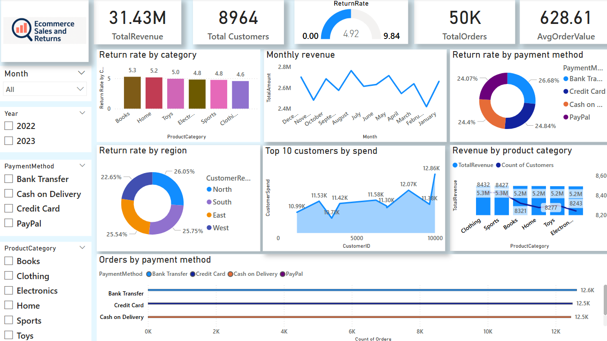

<!-- SEO: E-commerce Sales Dashboard | Power BI Project | SQL Analysis | Data Analyst Portfolio | marijatech -->
# 📊 Ecommerce Sales and Returns Analysis

## 📌 Overview  
This Power BI dashboard provides a comprehensive analysis of ecommerce performance, focusing on sales trends, return behavior, customer segmentation, and payment method impact. 
The goal is to help businesses make data-driven decisions regarding marketing, inventory, and customer retention strategies.

## 🧩 Dataset Information  
- **Size**: 50,000+ rows  
- **Fields**: Order Date, Product Category, Customer ID, Payment Method, Quantity, Unit Price, Total Amount, Returned, Region  

## ✅ Key Business Questions Answered 

### 1. Which product categories generate the most revenue?  
→ *Clothing* and *Sports* are the top-performing categories, each generating over **5.3M** in revenue.  
📌 *Recommendation*: Focus marketing campaigns and stock management efforts on these two categories. Consider expanding the product line within these segments to maximize ROI.

### 2. How does revenue fluctuate across months?  
→ A clear seasonal trend is observed, with revenue **peaking in summer** and **declining during early-year months**.  
📌 *Recommendation*: Launch targeted promotions during low-sales months and adjust operational planning (budget, workforce, logistics) based on expected demand cycles.

### 3. Which region has the highest return rate?  
→ The *West* region shows a significantly higher return rate at **25.75%**.  
📌 *Recommendation*: Conduct deeper analysis in that region to identify underlying issues (e.g. delivery time, product quality, miscommunication). Consider deploying surveys or customer service reviews.

### 4. What are the most used payment methods?  
→ *Bank Transfer* is the most used, followed closely by *Credit Card* and *Cash on Delivery*.  
📌 *Recommendation*: Keep all popular methods available but consider optimizing the checkout process for the top two to reduce cart abandonment and friction.

### 5. Is there a relationship between payment method and return rate?  
→ *Bank Transfer* customers have the highest return rate (**5.25%**), while *PayPal* customers have the lowest (**4.74%**).  
📌 *Recommendation*: Monitor purchasing behavior based on payment method and consider stricter validation or follow-up communication for higher-risk methods.

### 6. Who are the top 10 customers by spend?  
→ Customers spending **over 12K individually** were identified.  
📌 *Recommendation*: Create a loyalty strategy tailored to these high-value customers (e.g., early access to sales, VIP perks), as they represent strong retention and upsell opportunities.

### 7. What is the average order value and typical customer behavior?  
→ The average order value is **628.61**, with consistent behavior across customer segments.  
📌 *Recommendation*: Use this metric as a benchmark in future marketing efforts. Promote bundles or discounts that encourage customers to raise their AOV above this threshold.

## 🛠️ Tools Used  
- **Power BI**: Data modeling, interactive visuals, DAX measures, dashboard design  
- **SQL**: Data exploration, calculated fields, and preprocessing  
- **GitHub**: Version control and project organization  
- **Custom Branding**: Personalized logo and dashboard layout for professional presentation

## 📷 Dashboard Preview  

## 🚀 How to Use  
1. Clone or download this repository  
2. Open the `.pbix` file in Power BI Desktop  
3. Use interactive slicers to filter the data by **Month**, **Year**, **Payment Method**, and **Product Category**  
4. Hover over visuals to explore additional tooltips and insights  
5. Review summary KPIs and visual breakdowns to answer key business questions

